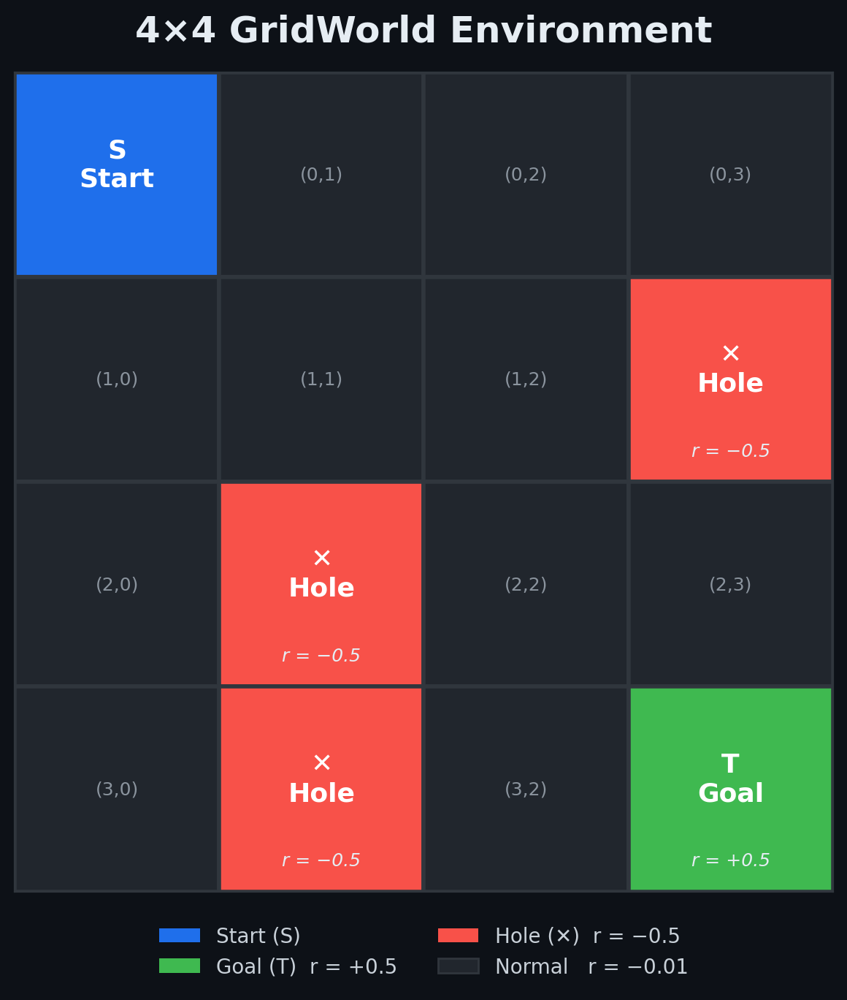
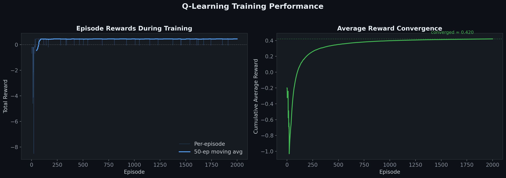
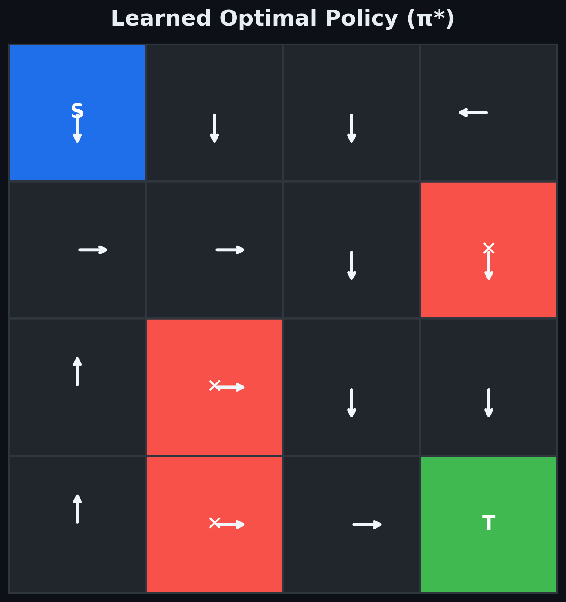
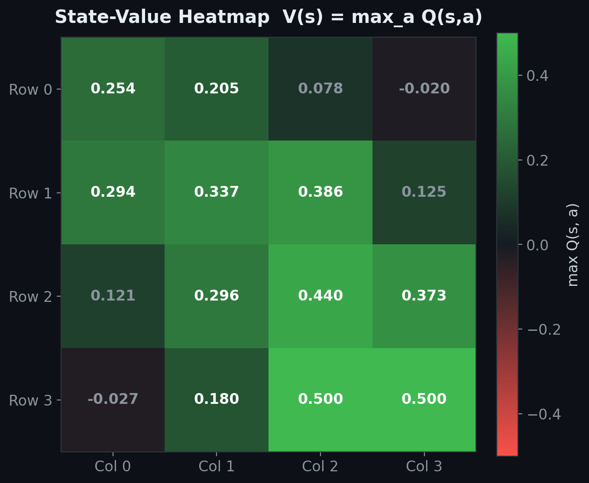
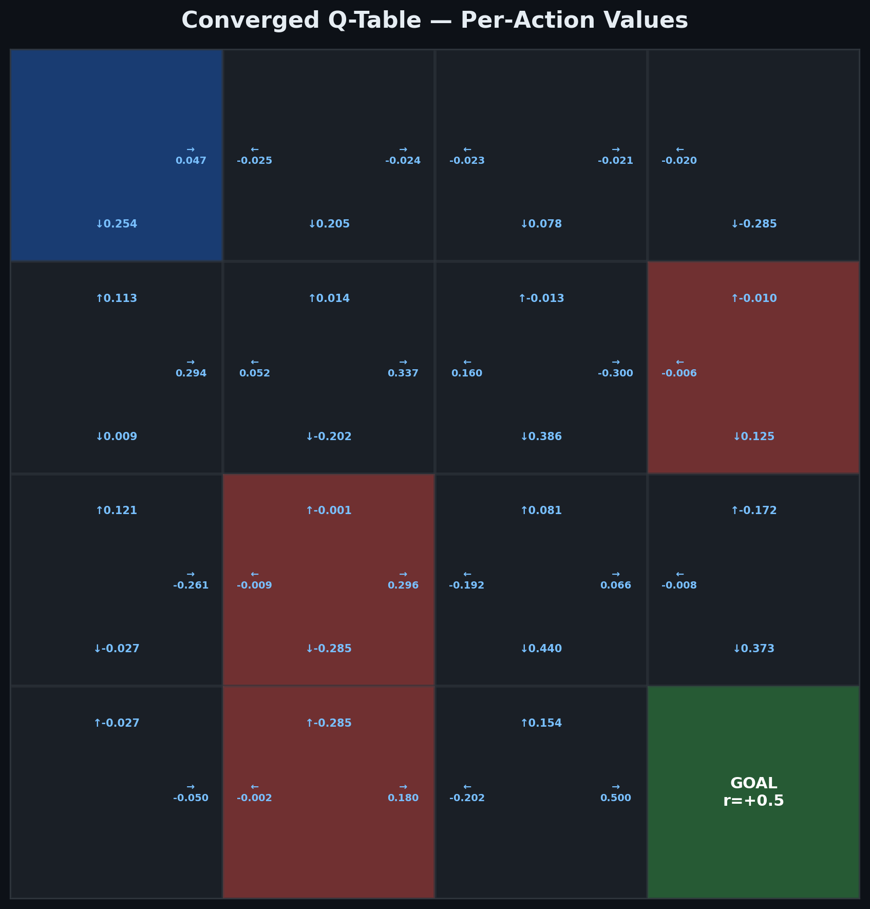
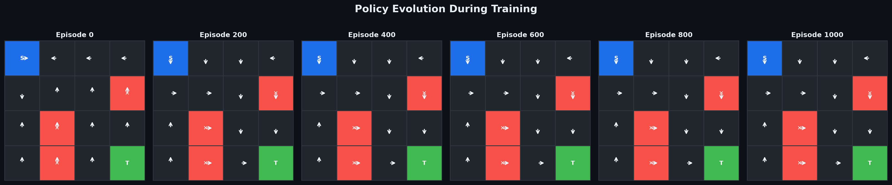
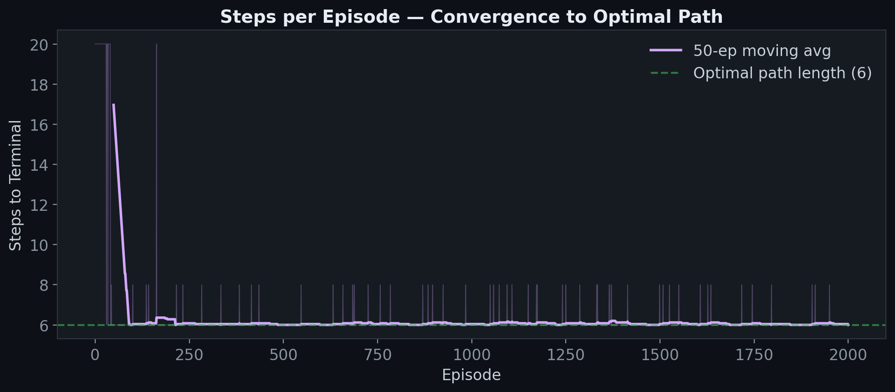
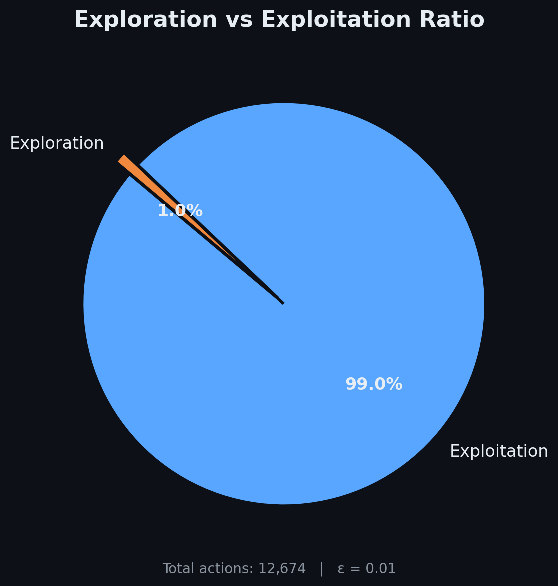

<div align="center">

# Q-Learning on a 4×4 GridWorld

### A From-Scratch Reinforcement Learning Implementation

**Tabular Q-Learning · Temporal-Difference Control · ε-Greedy Exploration**

[](https://python.org)
[](https://numpy.org)
[](https://matplotlib.org)

<br>

*A clean, dependency-minimal implementation of the Q-Learning algorithm applied to a deterministic grid navigation problem — inspired by OpenAI Gym's FrozenLake-v1 environment. Built to demonstrate core reinforcement learning principles without the abstraction layers of deep learning frameworks.*

</div>

---

## Environment

<div align="center">



</div>

The agent operates in a **4×4 deterministic grid** with the following topology:

| Cell | Type | Reward |
|------|------|--------|
| `(0,0)` | **Start (S)** | — |
| `(1,3)`, `(2,1)`, `(3,1)` | **Hole (✕)** | −0.5 |
| `(3,3)` | **Goal (T)** | +0.5 |
| All others | Normal | −0.01 |

- **State space:** 16 cells (15 non-terminal states)
- **Action space:** `{U, D, L, R}` — bounded by grid walls (invalid moves are excluded per state)
- **Transition dynamics:** Deterministic — the agent moves exactly in the chosen direction
- **Episode termination:** Reaching the Goal cell `(3,3)`, falling into a Hole, or exceeding 20 steps

The small per-step penalty of −0.01 incentivises the agent to find the **shortest path** to the goal rather than wandering.

---

## Algorithm — Tabular Q-Learning (Off-Policy TD Control)

This implementation uses the classical **Q-Learning** update rule (Watkins, 1989) — an off-policy temporal-difference method that directly estimates the optimal action-value function $Q^*(s,a)$ without requiring a model of the environment.

### Core Update Equation

$$Q(s_t, a_t) \leftarrow Q(s_t, a_t) + \alpha \Big[ r_{t+1} + \gamma \max_{a'} Q(s_{t+1}, a') - Q(s_t, a_t) \Big]$$

| Symbol | Parameter | Value |
|--------|-----------|-------|
| $\alpha$ | Learning rate | `0.1` |
| $\gamma$ | Discount factor | `0.9` |
| $\varepsilon$ | Exploration rate (ε-greedy) | `0.01` |
| — | Episodes | `2,001` |
| — | Max steps / episode | `20` |

### Algorithm Pseudocode

```
Initialize Q(s, a) = 0  for all state-action pairs
Initialize π randomly

for episode = 1 to 2001:
    s ← (0, 0)                          # start state
    while s is not terminal and steps < 20:
        a ← ε-greedy action from π(s)
        s', r ← environment.step(s, a)
        Q(s,a) ← Q(s,a) + α [r + γ max_a' Q(s',a') − Q(s,a)]
        s ← s'
    Update π(s) ← argmax_a Q(s,a)  for all s
```

> **Key property:** Q-Learning is **off-policy** — the update uses `max Q(s',a')` regardless of the action actually taken. This guarantees convergence to $Q^*$ under standard conditions (all state-action pairs visited infinitely often, decaying learning rate).

---

## Results

### Training Performance

<div align="center">



</div>

The agent converges to a stable positive average reward within ~200 episodes. The left panel shows the raw per-episode return (with 50-episode smoothing), while the right panel shows the cumulative average converging to ≈ **0.42** — indicating the agent reliably reaches the goal while avoiding all penalty cells.

### Learned Optimal Policy π*

<div align="center">



</div>

The converged policy demonstrates two key behaviors:
1. **Hole avoidance** — the agent routes around all three penalty cells at `(1,3)`, `(2,1)`, and `(3,1)`
2. **Shortest-path seeking** — the policy directs the agent along the most efficient trajectory from `S → T`

### State-Value Heatmap

<div align="center">



</div>

The state-value function $V(s) = \max_a Q(s,a)$ shows a clear **gradient increasing toward the goal** — a hallmark of correctly learned temporal-difference values. States near holes exhibit suppressed values due to proximity to negative reward.

### Converged Q-Table (Per-Action Values)

<div align="center">



</div>

The full Q-table after convergence reveals the action-value estimates for every state-action pair. Note how Q-values for actions leading toward holes are strongly negative, while the optimal action in each state has the highest Q-value — exactly as expected.

### Policy Evolution During Training

<div align="center">



</div>

The agent begins with a random policy (Episode 0) and rapidly converges to the optimal policy by Episode 200. The policy remains stable through the remaining 1,800 episodes — evidence of robust convergence.

### Steps-to-Goal Convergence

<div align="center">



</div>

The number of steps per episode drops from the maximum (20 — hitting the step limit) to the **optimal path length of 6 steps**, confirming the agent has discovered the shortest route. Occasional spikes correspond to the 1% exploration rate (ε = 0.01) forcing random actions.

### Exploration vs. Exploitation

<div align="center">



</div>

With ε = 0.01, the agent exploits its learned policy **99%** of the time while maintaining a minimal exploration budget — sufficient to escape local optima while preserving training stability.

---

## Project Structure

```
.
├── Reinforcement_Learning_solving_a_simple_4_4_Gridworld_using_Q_learning.py   # Standalone script
├── Reinforcement_Learning_solving_a_simple_4_4_Gridworld_using_Q_learning.ipynb # Jupyter notebook
├── generate_visuals.py                                                          # Visualization suite
├── a simple 4 by 4 Gridworld.png                                               # Grid diagram
├── simple 4 by 4 Gridworld.png                                                 # Grid diagram (alt)
├── Average Rewards.png                                                          # Average reward plot (script output)
├── Total Rewards.png                                                            # Total reward plot (script output)
├── assets/                                                                      # Advanced generated figures
│   ├── gridworld_env.png
│   ├── training_curves.png
│   ├── optimal_policy.png
│   ├── qvalue_heatmap.png
│   ├── qtable_detail.png
│   ├── policy_evolution.png
│   ├── steps_convergence.png
│   └── explore_exploit.png
└── README.md
```

## Quick Start

```bash
# Clone the repository
git clone https://github.com/MohammadAsadolahi/Reinforcement-Learning-solving-a-simple-4by4-Gridworld-using-Qlearning-in-python.git
cd Reinforcement-Learning-solving-a-simple-4by4-Gridworld-using-Qlearning-in-python

# Install dependencies
pip install numpy matplotlib

# Run the Q-Learning agent
python Reinforcement_Learning_solving_a_simple_4_4_Gridworld_using_Q_learning.py

# (Optional) Regenerate all figures
python generate_visuals.py
```

## Customization

| What to change | Where |
|----------------|-------|
| Grid size / layout | `GridWorld.actions` dictionary — add or remove `(row, col)` entries |
| Reward structure | `GridWorld.rewards` dictionary |
| Learning rate (α) | Variable `alpha` in the training loop |
| Discount factor (γ) | Hardcoded `0.9` in the Q-update on the training loop (replace the literal) |
| Exploration rate (ε) | Hardcoded `0.01` passed to `env.move()` in the training loop |
| Number of episodes | `range(1, N)` in the training loop |

---

## Theoretical Context

This project implements one of the foundational algorithms in Reinforcement Learning. Q-Learning belongs to the family of **model-free, off-policy, temporal-difference** methods and was first introduced by [Watkins (1989)](https://link.springer.com/article/10.1007/BF00992698). It is the tabular precursor to Deep Q-Networks (DQN) — the algorithm that achieved human-level performance on Atari games [(Mnih et al., 2015)](https://www.nature.com/articles/nature14236).

> **Note:** This is a *tabular* Q-Learning implementation — not Deep Q-Learning (DQN), which uses neural network function approximation.

### Key Concepts Demonstrated

| Concept | How it appears |
|---------|---------------|
| **Temporal-Difference Learning** | Single-step bootstrap updates using $r + \gamma \max Q(s',a')$ |
| **Off-Policy Control** | Policy improvement via greedy max over Q-values, independent of behavior policy |
| **ε-Greedy Exploration** | 1% random action probability ensures continued state-space coverage |
| **Value Function Convergence** | Q-table converges to $Q^*$ under Robbins-Monro conditions |
| **Policy Extraction** | Greedy policy $\pi(s) = \arg\max_a Q(s,a)$ derived from converged Q-table |

---

## Author

**Mohammad Asadolahi** — Senior Agentic AI Engineer

Focus: Agentic AI Architectures In The Wild

---

<div align="center">

*Built with NumPy and Matplotlib — no frameworks, no abstractions, just the math.*

</div>

---

<sub>This README was generated with AI assistance.</sub>
